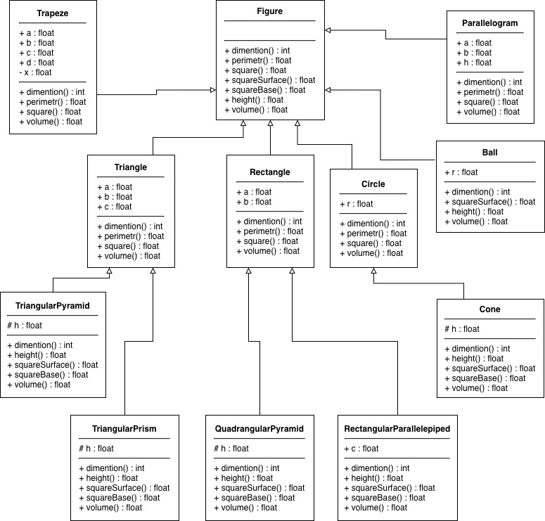

# Ієрархія просторових та плоских фігур (Наслідування та поліморфізм)

### Що робить програма
Ця програма на Python будує розгалуджену систему геометричних фігур, глибоко використовуючи принципи ООП - **наслідування** 
та **поліморфізм**.

В основі архітектури лежить базовий абстрактний клас `Figure`. Від нього наслідуються як плоскі (двовимірні) фігури, так 
і об'ємні (тривимірні), іноді створюючи багаторівневу ієрархію (наприклад, `Figure` -> `Rectangle` -> `QuadrangularPyramid`).

Завдяки поліморфізму, метод `volume()` універсально обчислює міру кожної фігури: для плоских це площа, а для просторових - 
об'єм. Також програма інкапсулює логіку виключень: спроба обчислити периметр для кулі або площу бічної поверхні для 
трапеції призведе до помилки, яка коректно обробляється базовим класом.

Алгоритм зчитує дані з текстових файлів, автоматично відфільтровує фізично неможливі фігури (через перевірки `assert`), 
створює об'єкти правильних фігур і знаходить серед них ту, що має найбільшу міру.

**UML-діаграма структури класів:**  

### Як запустити
1. Переконайтеся, що у вас встановлений Python 3.
2. Завантажте файл з кодом (`l_03.py`), текстові файли з даними (`input01.txt`, `input02.txt`, `input03.txt`) та файл 
діаграми (`uml.jpg`) в одну папку.
3. Відкрийте термінал, перейліть у цю папку та виконайте команду:  
`python l_03.py`

### Приклад вводу/виводу

**Приклад вводу (фрагмент з файлу input01.txt):**  
Cone 20 2  
Trapeze 8 25 9 4  
TriangularPyramid   21   10  
Rectangle    5   11  
Ball   24

**Приклад виводу в консоль:**  
Обробка файла input01.txt
У список додано 76 правильних фігур  
Міра цієї фігури найбільша у цьому файлі: Ball  
Її міра: 65449.85